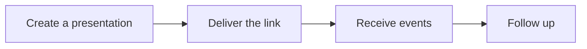

Connect your prospect workflow to AI Presentations in four stages.

## Create a presentation

Choose a template, then call `POST /api/decks/{deckId}/presentations` with prospect details, a `prospect_id`, or both. The response includes a personalized URL. See [Get a Presentation URL via API](/ai-presentations/guides/presentation-url-api) for requests and API key setup.

## Deliver the link

Send the returned URL through your CRM, email, or text workflow. To have AI Presentations email it, configure the template with `GET/PUT /api/decks/{deckId}/delivery` and call `POST /api/presentations/{presentationId}/send`. Journey ingest can send automatically. See [Automated email delivery](/ai-presentations/guides/notifications#automated-email-delivery) for recipient overrides and delivery tracking.

## Receive events

Create subscriptions before sharing links. Listen for `presentation.opened`, `slide.viewed`, `cta.clicked`, `appointment.booked`, and `contract.signed`; add `email.sent` and `email.opened` when using presentation emails. The [Notifications guide](/ai-presentations/guides/notifications) covers channels, payload verification, retries, and event versions.

## Act on engagement

Use the presentation ID to connect events to your prospect, update the CRM, and schedule follow-up. Acknowledge webhooks promptly and deduplicate by `event_id` before triggering actions. Use the [event log](/ai-presentations/guides/notifications#event-log) to investigate missing activity.
